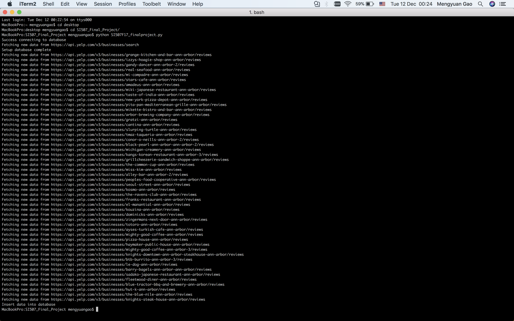
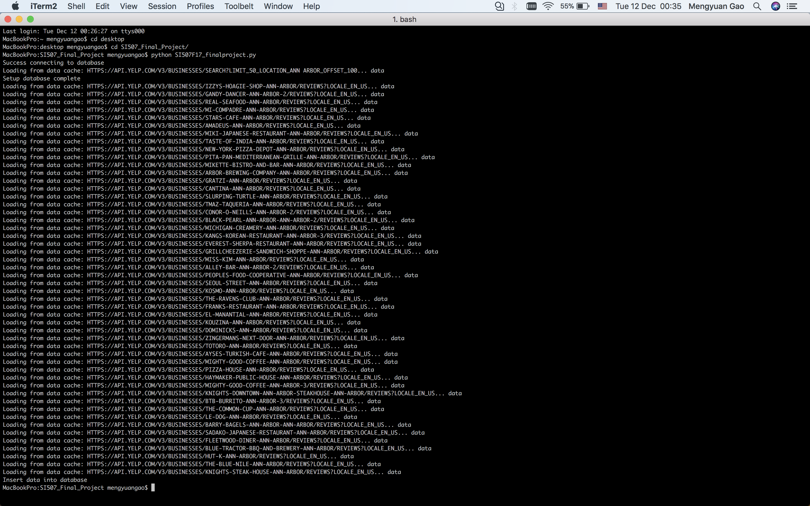
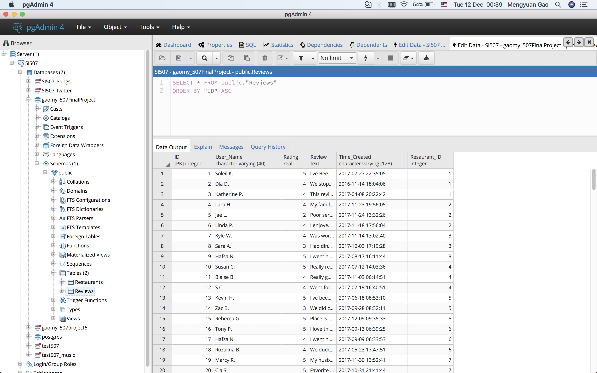

# SI507 Final Project

## Summary of the Project
This project aims to write python codes to get data from Yelp Fusion API about the restaurants information in Ann Arbor and then stored data into database.
Furthermore, these data will be manipulated using Tableau and a well organised Excel sheet will be provided for people to find the perfect restaurants in Ann Arbor easily. And some graphs will also show the overall structure of restaurants for people to understand the catering industry in Ann Arbor better.

## Data Source
Yelp is an application that provides information of restaurants and other kinds of stores. It allows people to search for restaurants in different locations and get information of a certain restaurant, including its' rating, reviews, phone number, address, etc. and also post their own reviews.
This project will use Yelp Fusion API, which relies on industry standard OAuth 2.0 protocol for granting access.Two kinds of APIs are used to get data in this project.
* [Yelp Fusion API Documentation](https://www.yelp.com/developers/documentation/v3)
* [Search API](https://www.yelp.com/developers/documentation/v3/business_search)
* [Reviews API](https://www.yelp.com/developers/documentation/v3/business_reviews)

## Steps
1. Preparation
* This project use a version of Python 3.6.3 and all modules needed are stated in the requirements.txt file. Before run the code, you should pip install everything to requirements.txt.
* Fill in your own key and secret in secret_data.py in order to run the code. You can create an App and find the right key and secret here:https://www.yelp.com/developers/v3/manage_app

2. Run the code-SI507F17_finalproject.py
* Part-1: A cache system was set up to cache data getting from Yelp API and it will be stored in the file "cache_contents.json". 
* Part-2: An OAuth system was set up to get authentication from Yelp API. 
* Part-3: Two classes(Restaurant and Review) are defined to stand for the information we want to obtain from a single restaurant and review. And methods are defined to extracted data and write data into csv files. For the Search API, location was entered as a parameter, we will focus on the restaurants in Ann Arbor in this project. For Reviews API, each restaurant we get from Search API, we will use its own Business ID as the parameter to get its reviews.
* Part-4: Database was set up to store the data into it. Two tables are created(Restaurants and Reviews).
* Part-5: Invoke all the functions.

If everything is ready, when you run the code for the first time, you will it fetch new data from Yelp:

The next time you run the code, you will see it loads data from the cache_contents.json:

## Outcomes
### CSV files
There will be two csv files generated containing the information we get.
* Ann Arbor.csv: this file contains the information of 50 restaurants in Ann Arbor(the maximum number we can get).
  * name:restaurants' name
  * category: which kind of restaurant they are
  * price: which price level they belong to, raning from $ to $$$
  * rating: the overall rating they get, raning from 1 to 5 with 1/2 interval
  * review_count: how many reviews they get
  * phone_number: their official phone number
  * address: their location in Ann Arbor

The CSV files should look like this:

* Ann Arbor_review.csv:this file contains information of reviews for each of those 50 restaurants in Ann Arbor, 3 piece of review information are provided.
  * user_name:the name of user who provide this review
  * rating: each user's own rating for this restaurant
  * review: each user's review
  * time_created: when this review was created

The CSV files should look like this:

### Database
There will be two tables stored in the database:
* Table1: Restaurants
  * ID: PRIMARY KEY
  * Name
  * Category
  * Price
  * Rating
  * Review_Count
  * Phone_Number
  * Address

Table1 should look like this:

* Table2: Reviews
  * ID:PRIMARY KEY
  * User_Name
  * Rating
  * Review
  * Time_Created
  * Restaurant_ID: FOREIGN KEY points to Table1 Restaurants(ID)

Table2 should look like this:

### Data Visualisation
All the data was processed with Tableau to make the data look more organised.
* A set of Excel sheets to provide well organised information of restaurants in Ann Arbor
  * Restaurants information grouping by Rating
  * Restaurants information grouping by Price
  * Restaurants information grouping by Category
  * Each Restaurant's reviews sorted by Rating
In this way, people can pick any restaurant they prefer from different perspectives and have access to the reviews very easily.

* Some graphs to show the structure of restaurants in Ann Arbor
  * Number of restaurants grouping by price: we can see restaurants with $$ price are the most
  * Number of restaurants grouping by rating: we can see that restaurants with a rating 3.5 are the most
  * Number of restaurants grouping by price and rating
  * Review counts of each restaurants: we can tell which restaurants are more popular 

#### P.S:
Thanks for Anand's help with the Yelp Authentication. 

